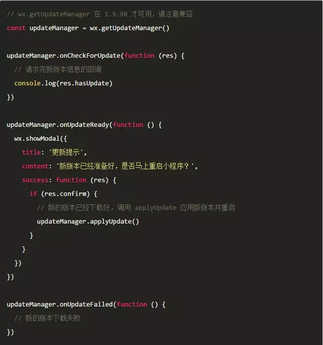

《小程序•小故事》第三期同大家分享小程序「更新机制」背后的故事。

背景

此前我们有收到开发者的反馈，当小程序发布新版本后，新版本覆盖率比较慢，尤其是遇到了一些紧急的 BUG时，线上覆盖速度令人着急。
为了解决这个问题，我们进行了一些探索，最终得出了一个解决方案——小程序更新机制，今天和大家分享一下。

小程序的更新机制
异步更新机制
小程序的更新需要经过两个关键的步骤：
Step1：向微信后台请求新版本信息；
Step2：从微信 CDN 下载小程序的代码包。
这两个步骤均需要网络链接，同时这两个步骤都是单独进行，并且是强依赖的，即如果没有新版本信息，就无法确定新版本的下载地址。

更新检测与下载流程通常会放在启动阶段进行，小程序平台也是如此。
不过小程序的更新流程与启动流程是同时并发执行。
即使更新信息拉取失败了，也不会影响小程序的启动；同时更新也不会影响到小程序的启动速度。
但由于小程序的更新流程是异步的，无法在本次启动就能够应用上新的版本，如果本次启动已经下载好新的版本了，需要在下次启动小程序时才能应用上新版本。

超过有效时间强制同步更新机制
为了尽量避免这种更新延迟情况，我们还设计了一个超过有效时间同步检查更新机制，假如用户已经超过7天没有打开过小程序了，这个时候会强制同步拉取新版本信息、下载新版本，并且使用新版本启动。

更新机制引起的问题
超过有效时间同步检查更新机制能确保到发布版本7天后，绝大部分用户能用上新的版本，但问题时在 7天之内使用的用户，可能在第一次启动时遇到的是异步更新机制，需要在第二次启动时才能应用新的版本。
这就导致了一些紧急发布无法在批量检查更新的 7天内无法覆盖到绝大部分用户，对于线上问题来说是很致命的。

解决这一问题的思路
为了解决这个问题，我们内部也经历了数个方案的讨论，与大家分享一下我们思考的过程：

1. 同步检查更新（放弃）
可能是最直接的解决思路，但这个方案的问题在于会影响小程序的启动速度，当下小程序的更新迭代是非常频繁的，部分用户可能每次启动都命中更新，如果需要同步检查更新 + 同步下载新的版本，那将会影响这部分用户的启动体验。

2. 模块热替换（放弃）
模块热替换是指小程序运行起来后，将新版本的 JS 代码与页面进行热替换，使之可以在当前版本上应用上新版本的功能。

这种方案可以解决异步更新不能在本次启动马上应用上的问题，从技术上来说，这也是最好的方案，但同时缺点也比较明显，会存在新旧逻辑、页面共存问题，对于开发者来说，反而更不好处理，特别是涉及到全局变量时，情况会更复杂。

但当然这个是我们未来努力的方向。

3. 缩小定时检查新版本轮询时间（目前方案）
6.6.3 及以上版本的客户端，会定时 check 最近使用过的小程序是否有发布新版本；如果有，下次冷启动（指打开非缓存在后台的小程序）的时候会同步更新新版本再打开。
这样可以保证在新版本发布 24 小时后，所有小程序都能使用最新版本。
这部分是微信客户端自身优化，开发者无需关心。

4. 异步更新 + 强制更新（目前方案）
同步检查更新与模块热替换两者之间的折衷方案，即还是维持异步更新机制，在异步下载完小程序代码包后，提供重启小程序的能力，这样在遇到紧急问题时可以马上解决，详请见下文介绍。

异步更新 + 强制更新方案介绍
从基础库 1.9.90 开始，我们提供了 wx.getUpdateManager 接口，使用该接口，可以获知是否有新版本小程序、新版本是否下载好以及应用新版本的能力。

当小程序冷启动时，会自动向微信后台请求新版本信息，如果有新版本，会马上触发新版本的下载。开发者可以通过 wx.getUpdateManager，获知当前更新的状态。

wx.getUpdateManager 接口会返回一个 UpdateManager 实例，UpdateManager 包含了三个回调：

1. onCheckForUpdate：当小程序向后台请求完新版本信息，会通知这个版本告知检查结果 
2. onUpdateReady：当新版本下载完成，会回调这个事件 
3. onUpdateFailed：当新版本下载失败，会回调这个事件 

还有重启应用新版本的接口：

1. applyUpdate：当新版本下载完成（onUpdateReady），调用该方法会强制当前小程序应用上新版本并重启

具体示例：
 

更详细信息可以参考 UpdateManager 的详细文档

应用场景
强制更新比较适合紧急修复场景， 可以确保在发布后用户能马上用上新版本。
但是强制更新会中断用户的操作，可能会带来一些不好的体验。
对于常规版本更新的场景，应尽量减少使用，或者是只是一个简单的提醒，由用户来主动触发重启应用操作，即界面上布置一些信息，提供主动触发重启更新按钮给到用户。

在强制重启更新前也建议先通过 showModal 方式咨询用户意见，待用户确认下再进行重启，实现方式可参考上节示例代码。

如何调试
最新版本的微信开发者工具提供了强制更新的调试能力，通过编译模式 - 编辑编译模式 - 勾上「下次编译时模拟更新」即可在开发者工具上调试强制更新功能。

最新开发者工具下载链接 点我。
